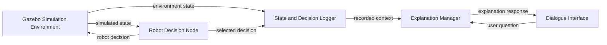

# Conceptual Architecture

This document outlines the intended high-level architecture for ExplainableHRC. It is conceptual and does not yet define message formats, algorithms, or implementation details.

## Components

### Gazebo Simulation Environment

Represents the construction-oriented HRI scenario, including the mobile robot, human worker, obstacles, and relevant environment state.

### Robot Decision Node

Uses the available simulated state to select a safety-related robot action, such as stopping, slowing down, waiting, replanning, or continuing.

### State and Decision Logger

Records the relevant state and the robot's selected decision so that explanations can refer to the circumstances in which a decision was made.

### Explanation Manager

Uses logged state and decision information to produce the requested explanation type and manage follow-up explanation context.

### Dialogue Interface

Accepts a user's explanation questions and presents responses from the Explanation Manager.

## Intended information flow

